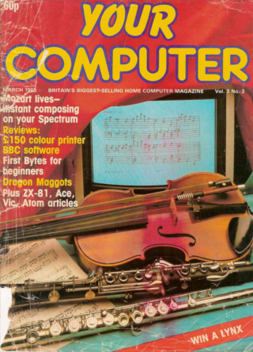
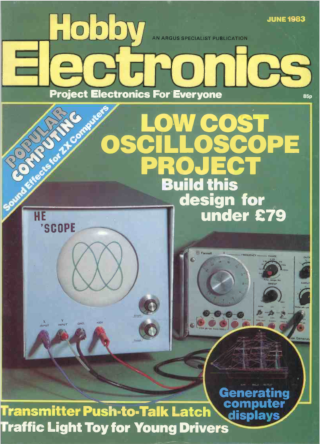

# Sinclair-ZX-PSG

In 1983 two specific magazine articles sparked my interest and imagination.  Both were designed as peripherals for the ZX-81 and ZX-Spectrum.  Both used General Instrument's AY-3-891x (PSG) sound chips.  Both projects were beyond my reach.  I likely could have made the circuit board for one of them and saved up for the components, but before too long my Speccy died and went back to Uncle Clive.  It was replaced with a Commodore 64 and the need for a PSG sound-card vanished.  But I never quite lost the fascination for the PSG.

Fast forward 40 or so years...  I bought a Spectrum, arranged for it to come to Canada and immediately got to work designing a simple multi-ROM card so I could run diagnostics (other, much-much better solutions exist, but this was quicker).  What to build next?  Over on the Retro Hardware Discord, a channel called zx81-soundblaster started to discuss AY-3-891x based sound cards for the ZX machines and an attempt to recreate one of them.  This nudged my brain to go in search of the two magazines I remembered from all those years previous.  I was able to find scans of the relevant magazines, the links to which are:

  
Fetch it here: [Your Computer, March 1983](https://archive.org/details/your-computer-magazine-1983-03/page/n61/mode/2up?q=dice)

  
Fetch it here: [Hobby Electronics, June 1983](https://www.worldradiohistory.com/UK/Hobby-Electronics/Hobby-Electronics-1983-06-S-OCR.pdf)

Before long I was busy with DipTrace (the schematic-capture and PCB layout program I use) entering the circuit-diagrams from the magazines and creating board layouts..

### Sinclair Sound Board, Hobby Electronics, June 1983
**Original Design by Charles Baudouin**  
**Development by Mike Lord**

The article starts on page 20 and is a brief 4-pages.  The design uses the AY-3-8912 and the article not only includes the circuit-diagram but a full-size board-layout too.  I entered the circuit as printed and took pride in ensuring I laid-out the PCB as close as possible to the one published.  The original board was signle-sided with two wire-jumpers.  I made the pleasing modification to use a double-sided board and replaced the jumpers with traces on the reverse-side.

The article does include a small program for the ZX-81 and another for the Spectrum though doesn't go into great detail about the details of how to program for it.

**Notes:**
- The circuit does not expose the eight GPIO bits (IOA0-IOA7)
- The clock is generated using a simple RC circuit fed into two otherwise spare gates on the logic ICs.  The clock frequency is approximately 3Mhz on the hardware I assembled (which seems faster than intended).
- The reset switch is only connected to the AY-chip.  It does not reset the Spectrum.
- The I/O ports of interest are:
  - `OUT 159` Write to Address Register
  - `IN 191` Read from Data Register
  - `OUT 223` Write to Data Register

### Mozart Lives, Your Computer, March 1983
**Original Design by Rod Hopkins**

The article starts on page 54 and ends on page 61 with two full page ads in between.  This design uses the AY-3-8910 yet the article only contains the circuit diagram.  The article does suggest that "it lays out naturally on 0.1" Vero board, with very little in the way of track-cutting or wiring involved".  I entered the circuit diagram as published and came up with my own PCB design.

The big draw for me about this article was that it came with some very cool-looking Spectrum software that would use the PSG to play some random music based on the Dice Waltz by Mozart.  I've included the software in this repo so you don't need to enter it yourself.  While I haven't (yet) fixed any bugs (indeed I may have created some), I have used modern tools to make entry and verification of the software easier plus I have added the ability to tailor the code for specific sound-cards with differing I/O port locations.

**Notes:**
- The circuit exposes the total of 16 GPIO lines from both ports A and B.
- The clock is generated using an RC circuit and three logic gates.  The clock frequency is approximately 1.65Mhz on the hardware I assembled.
- There is an auxilliary jack for headphones or amplified speakers.
- The I/O ports of interest are:
  - `OUT 221` Write to Address Register
  - `IN 221` Read from Data Register
  - `OUT 223` Write to Data Register

## What's in the Repo?

- `hardware/` DipTrace schematics and board-layout for each sound-card.  
  - `gerbers/` Zip files containing gerbers and drill files for each sound-card.  
  - `hobby-electronics` The Hobby-Electronics "Sinclair Sound Board" board.  
  - `your-computer` The Your Computer "Mozart Lives" board.  
- `media/` Pictures and other media for various markdown files.  
- `src/` Main source directory. 
  - `artifacts` Archived build artifacts (saved in repo)
  - `build/` Build artifacts (not saved in repo)  
  - `common/` Source-files for minuetz program plus test programs.
  - `releases/` Zip files containing .tap files for each supported sound-board.  
- `README.md` The README file you are looking at now.

The `releases/` and `build/` directories hold the recent results of the build (with `make`).  The `artifacts/` directory holds build artifacts and the releases at the time the repo was pushed.  Items in artifacts are only replaced when `make artifacts` is run.

## Getting Started
If you already have a ZX compatible sound-card and just wish to explore the minuetz software for the Spectrum, then the README.md file in the `src/` directory is a great place to start.  It covers where to find pre-built versions of the software, building the software, adapting the software to use different I/O ports and even which third-party software is used.

If you are interested in building one of the two sound-cards then you'll find valuable information in the README.md file in the `hardware/` directory.
