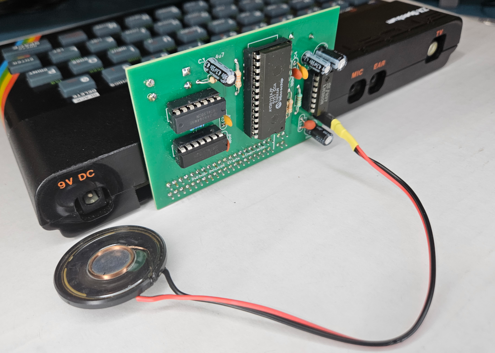
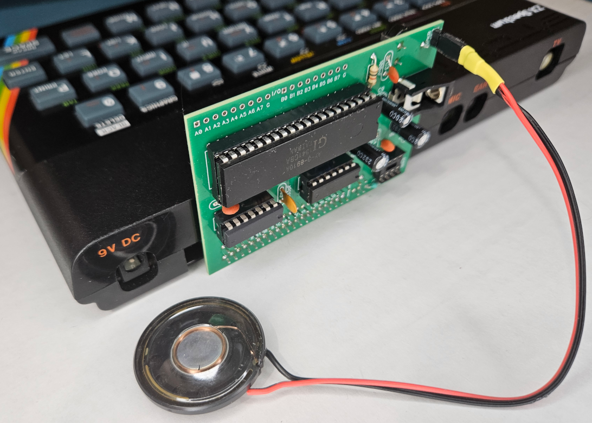

# HARDWARE

Contained in this directory are schematics, board-layouts and gerber files for two AY-3-891x based ZX compatible sound cards:

**`hobby-electroncs/`** contains the AY-3-8912 board by C Baudouin and M Lord as published in the June 1983 issue of Hobby Electronics.

**`your-computer/`** contains the AY-3-8910 board by R Hopkins and H Laverty as published in the March 1983 issue of Your Computer.

In both cases I've attempted to recreate the schematics from the magazines as closely as possible.

## Hobby Electronics

For the **Hobby Electronics** board, I used the provided PCB layout as a basis for the recreation.  The components are in the same places and the traces follow the same paths.  The only major difference is that instead of using the two jumper wires I converted them to use vias and a trace on the other side of the board.  
All the credit for this circuit-design and board goes to the original authors.  
I've created a PCBWay Shared Project for the Hobby Electronics ZX-Sound card here: [PCBWay HE ZX-Sound PCB](https://www.pcbway.com/project/shareproject/ZX_81_Spectrum_Sound_Card_Reproduction_Hobby_Electronics_June_1983_e98cb2c8.html)

## Your Computer

For the **Your Computer** board, there was no provided PCB layout just a comment in the text that suggests "It lays out naturally on 0.1in. pitch Vero board, with only very little in the way of track-cutting or wiring involved.".  No thank you.  I thought it might be fun to see if I could make this board the same size as the other one - so I got to work.  Again, the credit for the circuit-design goes to the original authors.  The board design is licensed for non-commercial use.  
I've created a PCBWay Shared Project for the Your Computer ZX-Sound card here: [PCBWay YC Mozart Lives PCB](https://www.pcbway.com/project/shareproject/ZX_81_Spectrum_Sound_Card_Reproduction_Your_Computer_March_1983_26fcb972.html)

## Components
Aside from the AY-3-8910 or AY-3-8912 chips, the components for these two boards are readily available from your favourite electronics retailer.  I've created BOM spreadsheets for each board that should help you source the parts easily.  Nothing is particularly special and similar parts can be substituted.

Edge connectors specific to the ZX81 (which also fit the Spectrum) aren't especially commonplace these days, though some Sinclair parts-shops sell them.  Alternatively a similar edge-connector can be sourced and adjusted to suit.  This can mean cutting the ends and any additional pins off plus fashioning the 'key'.  I tend to use a small pieced of polystyrene modelling plastic for this, though I understand that drilling a hold top-to-bottom in the empty spot and gluing a cut-nail in place also works well.

The AY-3-8910 and AY-3-8912 chips will have to be bought used or new-old-stock.  Sites such as AliExpress often have them (though prices and availability vary wildly).  Retro computer/arcade-game sites also carry these chips - and may even come tested!
The '8912 seems to be a little rarer these days - though I swear in 2020, they were more common than the '8910.

## Thoughts
My intention here was to recreate these sound-cards as closely as possible to the ones built back in 1983 by the authors.  I think I've achieved it.

But there's no harm in wondering how I might alter the designs, is there?

The major shortcoming of both boards is that they've both chosen to generate the clock using RC circuits.  I can't imagine there's any accuracy or consistency in these circuits.  It would take an extra IC but the clock could be derived from the 3.5MHz clock signal available on the edge connector.  A simple T or JK flip-flop can be used to halve the 3.5MHz down to a perfectly consistent 1.75MHz which is in the operational range of the PSG.

The Hobby Electronics board does not expose the IO port from the AY-3-8912.  It might be nice to have it available.

It would be possible to use a GAL for the address decoding (and perhaps even for the clock division).  A single board could then be made compatible with various other boards just by changing the GAL.  Additionally a jumper or two could be used as inputs to the GAL allowing it to pick between several port configurations.
